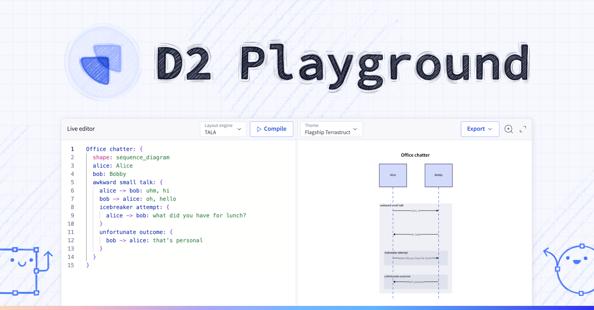
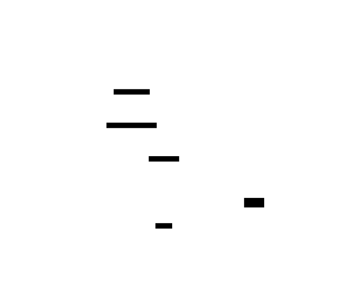

  
  <h2>
    An online runner to play, learn, and create with D2, the modern diagram scripting language that turns text to diagrams.
  </h2>

**Notice:** This is not the repository for the D2 language. That can be found [here](https://github.com/terrastruct/d2).

# Table of Contents

<!-- toc -->
- [FAQ](#faq)
  - [What is this written in?](#what-is-this-written-in)
  - [How does it work?](#how-does-it-work)
  - [What's this API?](#whats-this-api)
- [Contributing](#contributing)
- [Dependencies](#dependencies)

## FAQ

### What is this written in?

Vanilla HTML, CSS, and Javascript.

### How does it work?

### What's this API?

We are working on a full WASM build of D2 that includes the layout engines, but it
requires optimizations to get the build size down to be manageable for the web. Tracking
here:
[https://github.com/terrastruct/d2/pull/436/files](https://github.com/terrastruct/d2/pull/436/files).

When this is ready, Playground will offer two options: a fully offline, local version
powered by D2 WASM running on your browser, and an API version, for running on low-power
machines. Currently, the API just takes an encoded D2 script and runs the layout engine.
It saves no data and does nothign else.

## Contributing

Contributions are welcome!

1. Install `esbuild`:
   [https://esbuild.github.io/getting-started/#install-esbuild](https://esbuild.github.io/getting-started/#install-esbuild)
1. Run `git submodule update --init --recursive` to pull the submodules (D2's VSCode plugin
   for syntax highlighting, and our CI library).
1. Go to `src/js` and run `yarn` to get the Node modules.
1. Run `./ci/dev.sh` to start the development server. It will automatically find an available port starting from 9090.

## Dependencies

External dependencies are kept to a minimum. Currently they are:
1. [Monaco Editor](https://github.com/microsoft/monaco-editor) for text editing features.
1. [Panzoom](https://github.com/anvaka/panzoom) for SVG navigation.

Both are not ideal. Monaco is unnecessarily heavy and Panzoom lacks scrolling. The plan is
to replace these one day.

If you're a contributor, please do not add any dependencies without discussing first.
